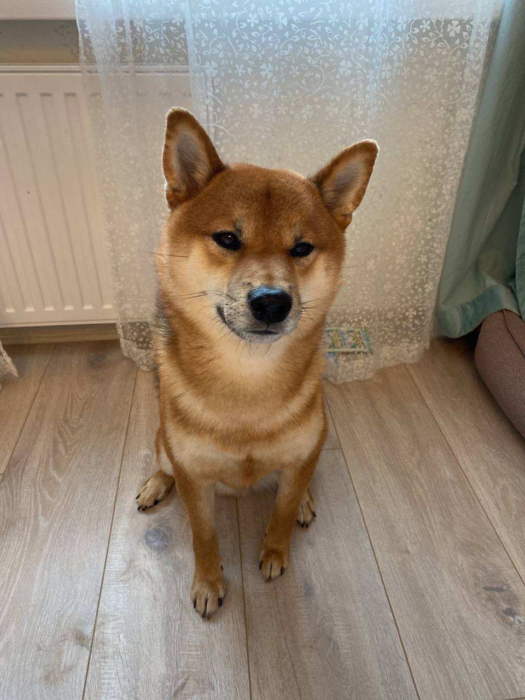

# *Привет, меня зовут Настя.*

### Мне 32 года, я из Санкт-Петербурга, но сейчас живу в Казахстане.
---
У меня есть классная собака, которая осталась в Питере. Пса зовут **Такеши**, его порода называется [Сиба-Ину](https://ru.wikipedia.org/wiki/%D0%A1%D0%B8%D0%B1%D0%B0-%D0%B8%D0%BD%D1%83). Мы всей семьей скучаем по нему и ждем нашей встречи с нетерпением.
# 